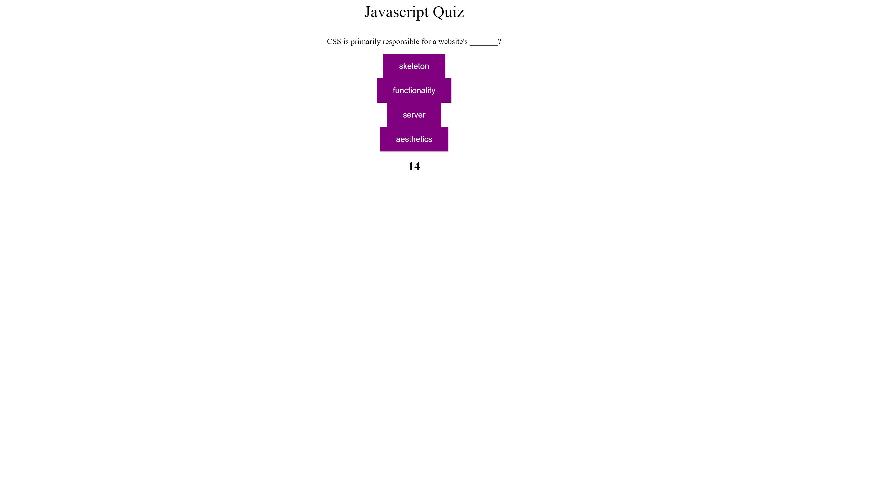

# Time-Javascript-Quiz

## Description

This project created a programming quiz, written in Javascript, CSS, and HTML, with some Jquery added in. The program iterates through a list of questions, each with four possible options, while a timer counts down on screen. When the quiz ends, the user can enter a name and see their score, based on the number of correct answers.

## Installation

May be viewed live at: .

## Usage

Press the start button to begin the quiz. The countdown will begin, and you will be able to click on answers to each question. Each wrong answer will reduce the time remaining by 2 seconds, whereas each correct answer will increase it by two. When the quiz ends, enter your name to see the high score list.


    ```md
    
    ```